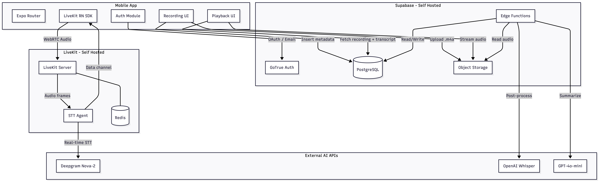
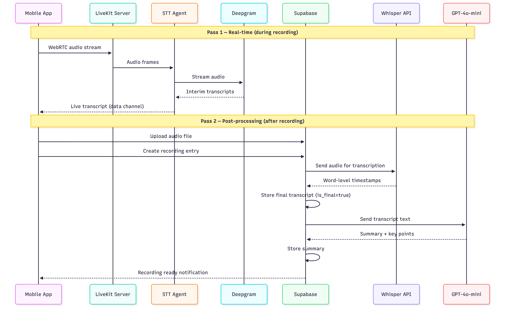

# VoiceMind

AI-powered voice memos with real-time transcription, word-level highlighted playback, and automatic summarization.

## Tech Stack

| Layer           | Technology                                                     |
| --------------- | -------------------------------------------------------------- |
| Mobile          | React Native + Expo SDK 54                                     |
| Real-time Audio | LiveKit (self-hosted)                                          |
| Backend         | Supabase (self-hosted)                                         |
| Transcription   | Deepgram Nova-2 (real-time) + OpenAI Whisper (post-processing) |
| Summarization   | OpenAI GPT-4o-mini                                             |
| UI              | Gluestack UI v2 + NativeWind v4                                |
| Language        | TypeScript throughout                                          |
| Package Manager | pnpm (monorepo workspaces)                                     |

## Architecture



## Two-Pass Transcription



## Monorepo Structure

```
voicemind/
├── apps/
│   ├── mobile/          # Expo SDK 54 — React Native app
│   ├── web/             # Next.js (Phase 2 — future)
│   └── desktop/         # Tauri (Phase 3 — future)
├── packages/
│   ├── shared/          # Shared types, utilities, constants
│   └── supabase/        # Migrations, edge functions, config
├── infrastructure/      # Docker Compose, LiveKit, Caddy, scripts
└── docs/                # Detailed setup guides
```

## Quick Start

### Prerequisites

- Node.js >= 20.19.4
- pnpm (`npm install -g pnpm`)
- Xcode 26 (iOS) or Android Studio with SDK 36 (Android)
- A VPS with Docker for self-hosted services

### 1. Clone and Install

```bash
git clone <repo-url> voicemind
cd voicemind
pnpm install
```

### 2. Configure Environment

```bash
cp apps/mobile/.env.example apps/mobile/.env
# Fill in your Supabase and LiveKit URLs
```

### 3. Run the Mobile App

```bash
# Start Expo dev server
pnpm dev:mobile

# Build for iOS (requires dev client for LiveKit)
cd apps/mobile
npx expo prebuild --clean
npx expo run:ios
```

> LiveKit requires native modules — Expo Go is not supported. Use development builds via `expo-dev-client`.

## Documentation

| Guide                                             | Description                                                          |
| ------------------------------------------------- | -------------------------------------------------------------------- |
| [Mobile App Setup](docs/mobile-setup.md)          | Expo development builds, running on device, NativeWind configuration |
| [Infrastructure Overview](docs/infrastructure.md) | VPS requirements, Docker Compose, Caddy reverse proxy, SSL           |
| [Supabase Setup](docs/supabase-setup.md)          | Self-hosted Supabase, Google OAuth, environment variables            |
| [LiveKit Setup](docs/livekit-setup.md)            | Self-hosted LiveKit server, TURN, STT agent deployment               |
| [Database Schema](docs/database-schema.md)        | Tables, RLS policies, migrations, ER diagram                         |
| [Edge Functions API](docs/edge-functions.md)      | Token generation, transcription, summarization endpoints             |

## Scripts

```bash
pnpm dev:mobile              # Start Expo dev server
pnpm build:mobile:ios        # Build iOS
pnpm build:mobile:android    # Build Android
pnpm lint                    # Lint all packages
pnpm typecheck               # Typecheck all packages
```

## License

MIT
