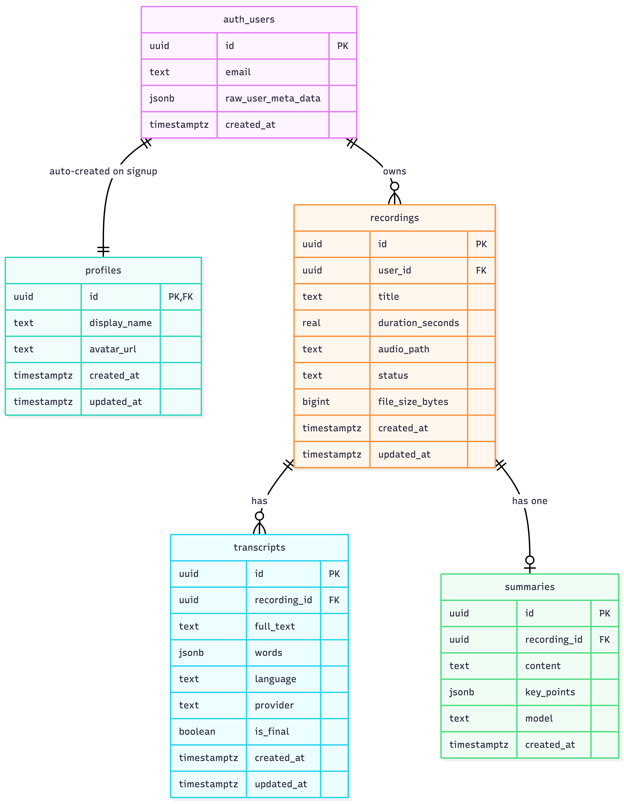
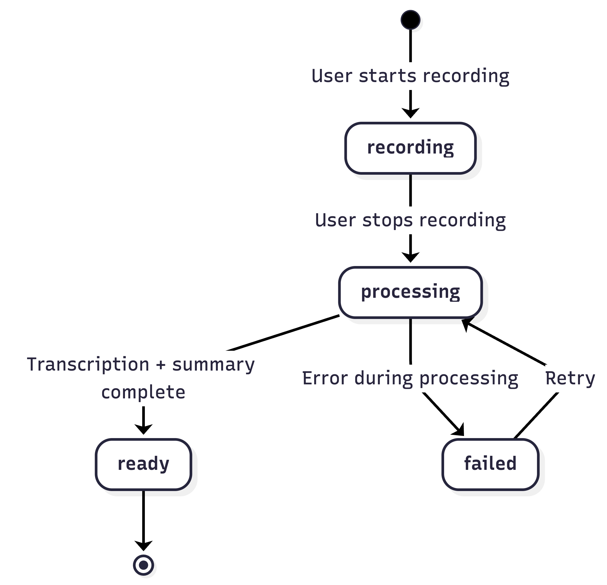

# Database Schema

VoiceMind uses PostgreSQL (via self-hosted Supabase) with Row-Level Security (RLS) on all tables. Every user can only access their own data.

## Entity Relationship Diagram



## Tables

### `profiles`

Extends Supabase `auth.users` with display info. Auto-created via trigger on signup.

| Column         | Type          | Default | Notes                        |
| -------------- | ------------- | ------- | ---------------------------- |
| `id`           | `uuid` PK     | —       | References `auth.users(id)`  |
| `display_name` | `text`        | —       | From Google profile or email |
| `avatar_url`   | `text`        | —       | From Google profile          |
| `created_at`   | `timestamptz` | `now()` |                              |
| `updated_at`   | `timestamptz` | `now()` |                              |

**RLS Policies:**

- `SELECT` — Users can view own profile
- `UPDATE` — Users can update own profile

### `recordings`

Core table for voice memo metadata.

| Column             | Type          | Default                | Notes                                                |
| ------------------ | ------------- | ---------------------- | ---------------------------------------------------- |
| `id`               | `uuid` PK     | `gen_random_uuid()`    |                                                      |
| `user_id`          | `uuid` FK     | —                      | References `auth.users(id)`                          |
| `title`            | `text`        | `'Untitled Recording'` |                                                      |
| `duration_seconds` | `real`        | `0`                    |                                                      |
| `audio_path`       | `text`        | —                      | Supabase Storage path: `{user_id}/{id}.m4a`          |
| `status`           | `text`        | `'recording'`          | One of: `recording`, `processing`, `ready`, `failed` |
| `file_size_bytes`  | `bigint`      | `0`                    |                                                      |
| `created_at`       | `timestamptz` | `now()`                |                                                      |
| `updated_at`       | `timestamptz` | `now()`                |                                                      |

**Indexes:**

- `idx_recordings_user_id` on `user_id`
- `idx_recordings_created_at` on `created_at DESC`

**RLS Policies:**

- `ALL` — Users can CRUD own recordings

### `transcripts`

Stores both live (Deepgram) and post-processed (Whisper) transcripts.

| Column         | Type          | Default             | Notes                                     |
| -------------- | ------------- | ------------------- | ----------------------------------------- |
| `id`           | `uuid` PK     | `gen_random_uuid()` |                                           |
| `recording_id` | `uuid` FK     | —                   | References `recordings(id)`               |
| `full_text`    | `text`        | `''`                | Complete transcript text                  |
| `words`        | `jsonb`       | `'[]'`              | Array of `{word, start, end, confidence}` |
| `language`     | `text`        | `'en'`              | Detected language                         |
| `provider`     | `text`        | `'whisper'`         | `'deepgram'` or `'whisper'`               |
| `is_final`     | `boolean`     | `false`             | `false` = live, `true` = post-processed   |
| `created_at`   | `timestamptz` | `now()`             |                                           |
| `updated_at`   | `timestamptz` | `now()`             |                                           |

**Words JSONB structure:**

```json
[
  { "word": "Hello", "start": 0.0, "end": 0.45, "confidence": 0.98 },
  { "word": "world", "start": 0.5, "end": 0.92, "confidence": 0.95 }
]
```

**RLS Policies:**

- `SELECT` — Users can view transcripts for their own recordings
- `INSERT` — Users can insert transcripts for their own recordings

### `summaries`

AI-generated summaries with key points. One per recording.

| Column         | Type          | Default             | Notes                                |
| -------------- | ------------- | ------------------- | ------------------------------------ |
| `id`           | `uuid` PK     | `gen_random_uuid()` |                                      |
| `recording_id` | `uuid` FK     | —                   | `UNIQUE` — one summary per recording |
| `content`      | `text`        | —                   | Summary text (2-4 sentences)         |
| `key_points`   | `jsonb`       | `'[]'`              | Array of strings                     |
| `model`        | `text`        | `'gpt-4o-mini'`     | AI model used                        |
| `created_at`   | `timestamptz` | `now()`             |                                      |

**RLS Policies:**

- `SELECT` — Users can view summaries for their own recordings

## Storage

### `recordings` Bucket

Private bucket for audio files. Path convention: `{user_id}/{recording_id}.m4a`

**Policies:**

- `INSERT` — Users can upload to their own folder
- `SELECT` — Users can read from their own folder
- `DELETE` — Users can delete from their own folder

Folder ownership is enforced by checking `auth.uid()::text = (storage.foldername(name))[1]`.

## Recording Lifecycle



| Status       | Description                                       |
| ------------ | ------------------------------------------------- |
| `recording`  | Audio is being captured                           |
| `processing` | Audio uploaded, transcription/summary in progress |
| `ready`      | Transcript and summary available                  |
| `failed`     | Processing error — can be retried                 |

## Migrations

Located in `packages/supabase/migrations/`. Apply in order:

```bash
00001_create_profiles.sql
00002_create_recordings.sql
00003_create_transcripts.sql
00004_create_summaries.sql
00005_create_storage.sql
```

See [Supabase Setup](supabase-setup.md) for how to run them.

## Related Guides

- [Supabase Setup](supabase-setup.md) — Deploying Supabase and running migrations
- [Edge Functions](edge-functions.md) — Functions that read/write these tables
