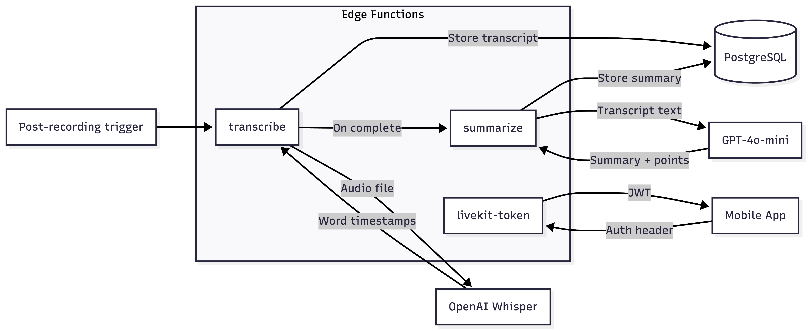
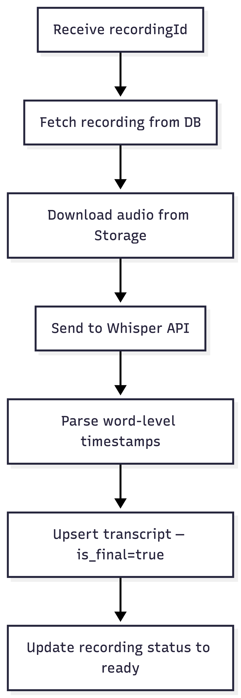
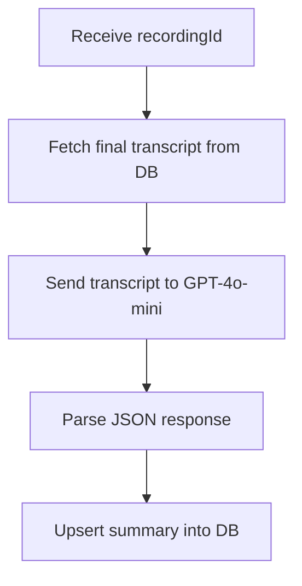

# Edge Functions API

VoiceMind uses three Supabase Edge Functions for token generation, transcription, and summarization. All functions run on Deno and are deployed to the self-hosted Supabase instance.

## Overview



## Required Secrets

Set these on your Supabase instance:

```bash
supabase secrets set \
  LIVEKIT_API_KEY=<your-key> \
  LIVEKIT_API_SECRET=<your-secret> \
  OPENAI_API_KEY=<your-key>
```

These are available as `Deno.env.get('...')` inside functions.

---

## `livekit-token`

Generates a LiveKit JWT access token for authenticated users. Called before joining a recording room.

**Location:** `packages/supabase/functions/livekit-token/index.ts`

### Request

```
POST /functions/v1/livekit-token
Authorization: Bearer <supabase-session-token>
Content-Type: application/json
```

```json
{
  "roomName": "recording-abc123"
}
```

### Response

```json
{
  "token": "eyJhbGciOiJIUzI1NiIs..."
}
```

### Errors

| Status | Body                             | Cause                                       |
| ------ | -------------------------------- | ------------------------------------------- |
| 401    | `{"error": "Unauthorized"}`      | Missing or invalid auth header              |
| 400    | `{"error": "roomName required"}` | No `roomName` in request body               |
| 500    | `{"error": "..."}`               | Server error (check LIVEKIT_API_KEY/SECRET) |

### Usage in App

```typescript
const { data } = await supabase.functions.invoke('livekit-token', {
  body: { roomName: `recording-${recordingId}` },
});
// data.token → use with LiveKitRoom component
```

---

## `transcribe`

Post-processing transcription using OpenAI Whisper. Downloads the audio file from Supabase Storage, sends it to Whisper with word-level timestamps, and stores the result.

**Location:** `packages/supabase/functions/transcribe/index.ts`

### Request

```
POST /functions/v1/transcribe
Content-Type: application/json
```

```json
{
  "recordingId": "uuid-of-recording"
}
```

> This function uses the `SERVICE_ROLE_KEY` internally — it does not require user auth since it's triggered server-side.

### What It Does



### Response

```json
{
  "success": true,
  "text": "Hello, this is my voice memo about..."
}
```

### Whisper Configuration

| Parameter             | Value          |
| --------------------- | -------------- |
| Model                 | `whisper-1`    |
| Response format       | `verbose_json` |
| Timestamp granularity | `word`         |

### Errors

| Status | Body                                  | Cause                |
| ------ | ------------------------------------- | -------------------- |
| 400    | `{"error": "recordingId required"}`   | Missing parameter    |
| 404    | `{"error": "Recording not found"}`    | Invalid recording ID |
| 500    | `{"error": "Whisper API error: ..."}` | OpenAI API failure   |

---

## `summarize`

Generates a summary and key points from a completed transcript using GPT-4o-mini.

**Location:** `packages/supabase/functions/summarize/index.ts`

### Request

```
POST /functions/v1/summarize
Content-Type: application/json
```

```json
{
  "recordingId": "uuid-of-recording"
}
```

### What It Does



### GPT Configuration

| Parameter       | Value         |
| --------------- | ------------- |
| Model           | `gpt-4o-mini` |
| Temperature     | `0.3`         |
| Response format | `json_object` |

### System Prompt

The function instructs GPT to return:

- A concise summary (2-4 sentences)
- A list of key points (3-7 bullet points)

### Response

```json
{
  "success": true,
  "summary": "The speaker discussed project deadlines and team assignments...",
  "key_points": [
    "Project deadline moved to March 15",
    "Design team needs two more resources",
    "Weekly sync meetings start next Monday"
  ]
}
```

### Errors

| Status | Body                                 | Cause                      |
| ------ | ------------------------------------ | -------------------------- |
| 400    | `{"error": "recordingId required"}`  | Missing parameter          |
| 404    | `{"error": "No transcript found"}`   | No final transcript exists |
| 500    | `{"error": "OpenAI API error: ..."}` | GPT API failure            |

---

## Deployment

```bash
# Deploy individual function
supabase functions deploy livekit-token
supabase functions deploy transcribe
supabase functions deploy summarize

# Deploy all at once
for fn in livekit-token transcribe summarize; do
  supabase functions deploy $fn
done
```

## Calling from the App

All functions are called via the Supabase client:

```typescript
// Authenticated call (livekit-token)
const { data, error } = await supabase.functions.invoke('livekit-token', {
  body: { roomName: 'room-123' },
});

// Server-side calls (transcribe, summarize) are triggered
// after recording upload — not called directly from the app
```

## Related Guides

- [Supabase Setup](supabase-setup.md) — Deploying functions to self-hosted Supabase
- [Database Schema](database-schema.md) — Tables these functions read/write
- [LiveKit Setup](livekit-setup.md) — Token usage with LiveKit rooms
