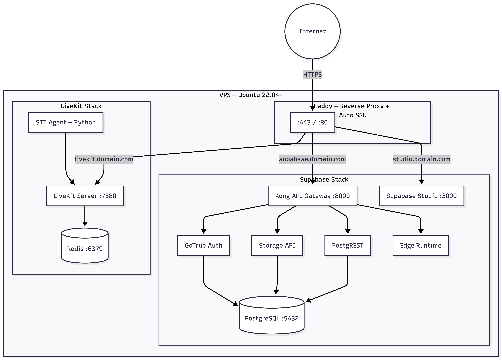
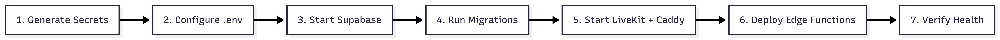

# Infrastructure Overview

VoiceMind runs on a self-hosted stack: **Supabase** (Postgres, Auth, Storage, Edge Functions) and **LiveKit** (WebRTC, STT agent). Both are deployed via Docker on a VPS with Caddy as a reverse proxy for automatic SSL.

## High-Level Deployment



## VPS Requirements

| Spec           | Minimum          | Recommended      |
| -------------- | ---------------- | ---------------- |
| RAM            | 8 GB             | 16 GB            |
| CPU            | 4 vCPUs          | 4+ vCPUs         |
| Storage        | 50 GB SSD        | 100 GB SSD       |
| OS             | Ubuntu 22.04 LTS | Ubuntu 24.04 LTS |
| Docker         | v24+             | Latest           |
| Docker Compose | v2+              | Latest           |

### Required Ports

| Port        | Protocol | Service                     |
| ----------- | -------- | --------------------------- |
| 80          | TCP      | Caddy — HTTP (TLS issuance) |
| 443         | TCP      | Caddy — HTTPS + TURN/TLS    |
| 3478        | UDP      | LiveKit — TURN              |
| 5432        | TCP      | PostgreSQL (internal only)  |
| 7881        | TCP      | LiveKit — WebRTC/TCP        |
| 50000–60000 | UDP      | LiveKit — WebRTC media      |

> Ports 5432 should **not** be exposed publicly. Use firewall rules to restrict access.

## DNS Configuration

Create A records pointing to your VPS IP:

| Subdomain                 | Target | Purpose         |
| ------------------------- | ------ | --------------- |
| `supabase.yourdomain.com` | VPS IP | Supabase API    |
| `studio.yourdomain.com`   | VPS IP | Supabase Studio |
| `livekit.yourdomain.com`  | VPS IP | LiveKit server  |
| `turn.yourdomain.com`     | VPS IP | TURN server     |

## Secrets Generation

Use the included helper script:

```bash
cd infrastructure
./scripts/generate-secrets.sh
```

This generates:

- PostgreSQL password
- JWT secret (32+ characters)
- LiveKit API key and secret

Copy the output into your `.env` file:

```bash
cp .env.example .env
# Paste generated secrets
```

## Docker Compose

The `infrastructure/docker-compose.yml` orchestrates LiveKit services:

```bash
cd infrastructure
docker compose up -d
```

Services started:

| Service               | Image                    | Purpose             |
| --------------------- | ------------------------ | ------------------- |
| `livekit`             | `livekit/livekit-server` | WebRTC server       |
| `redis`               | `redis:7-alpine`         | LiveKit state store |
| `transcription-agent` | Custom Python            | Deepgram STT agent  |
| `caddy`               | `caddy:2-alpine`         | Reverse proxy + SSL |

> Supabase has its own Docker Compose. See [Supabase Setup](supabase-setup.md).

## Caddy Configuration

Caddy automatically provisions Let's Encrypt SSL certificates. Configuration lives at `infrastructure/caddy/Caddyfile`:

```
supabase.yourdomain.com {
    reverse_proxy localhost:8000
}

studio.yourdomain.com {
    reverse_proxy localhost:3000
}

livekit.yourdomain.com {
    reverse_proxy localhost:7880
}
```

Replace `yourdomain.com` with your actual domain before deploying.

## Startup Sequence



1. Generate secrets: `./scripts/generate-secrets.sh`
2. Fill in `.env` with secrets + API keys
3. Start Supabase: See [Supabase Setup](supabase-setup.md)
4. Run migrations: Apply SQL files from `packages/supabase/migrations/`
5. Start LiveKit stack: `docker compose up -d`
6. Deploy edge functions: See [Edge Functions](edge-functions.md)
7. Verify: Check `https://supabase.yourdomain.com/rest/v1/` and `wss://livekit.yourdomain.com`

## Monitoring

```bash
# View all container logs
docker compose logs -f

# Check specific service
docker compose logs -f livekit
docker compose logs -f transcription-agent

# Container health
docker compose ps

# Resource usage
docker stats
```

## Related Guides

- [Supabase Setup](supabase-setup.md) — Self-hosted Supabase with Docker
- [LiveKit Setup](livekit-setup.md) — LiveKit server, TURN, and STT agent
- [Edge Functions](edge-functions.md) — Deploying serverless functions
