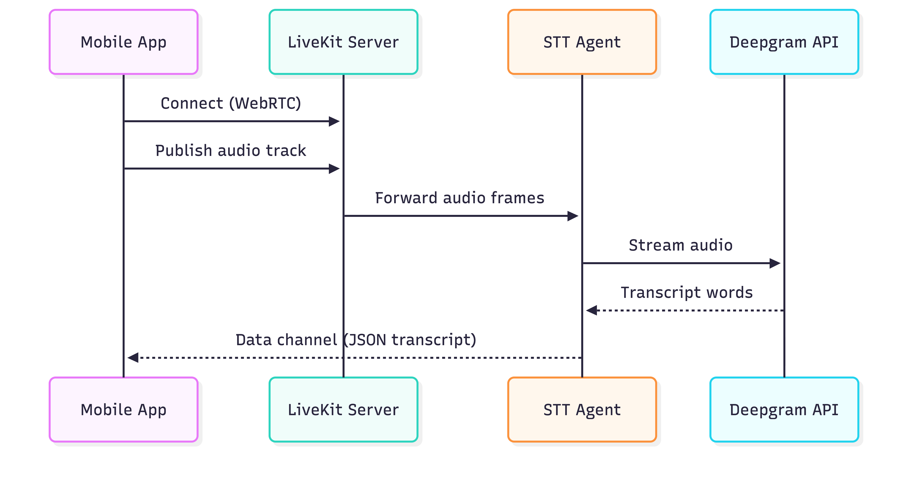
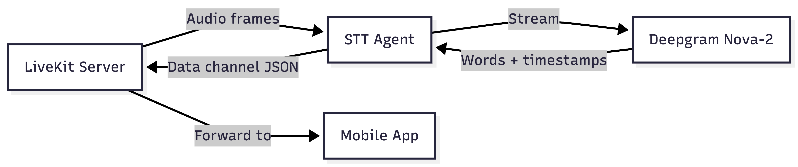

# LiveKit Setup (Self-Hosted)

Guide for deploying a self-hosted LiveKit server with TURN and the Deepgram STT transcription agent.

## What LiveKit Does in VoiceMind



LiveKit handles:

- **WebRTC audio transport** between the mobile app and the server
- **Room management** for isolating each recording session
- **Data channels** for sending real-time transcripts back to the app
- **TURN relay** for clients behind restrictive firewalls/NATs

## Step 1 — Generate Configuration

On your VPS:

```bash
docker run --rm -it -v$PWD:/output livekit/generate
```

Follow the prompts:

| Prompt          | Recommended Value            |
| --------------- | ---------------------------- |
| Deployment type | With both Egress and Ingress |
| Domain          | `livekit.yourdomain.com`     |
| TURN domain     | `turn.yourdomain.com`        |
| SSL provider    | Let's Encrypt                |
| LiveKit version | Latest                       |
| Include Redis   | Yes                          |

The generator creates:

- `docker-compose.yaml`
- `livekit.yaml` (server config)
- `caddy.yaml` (SSL/reverse proxy)
- `redis.conf`

Save the generated **API Key** and **API Secret** — you'll need them in your `.env`.

## Step 2 — Manual Configuration

Alternatively, use the config from the repo at `infrastructure/livekit/livekit.yaml`:

```yaml
port: 7880
rtc:
  tcp_port: 7881
  port_range_start: 50000
  port_range_end: 60000
  use_external_ip: true

redis:
  address: localhost:6379

keys:
  your-api-key: your-api-secret

turn:
  enabled: true
  domain: turn.yourdomain.com
  tls_port: 443
  udp_port: 3478
```

Replace `your-api-key` and `your-api-secret` with the values from `generate-secrets.sh`.

## Step 3 — Firewall Rules

```bash
# Required ports
sudo ufw allow 80/tcp      # HTTP (TLS issuance)
sudo ufw allow 443/tcp     # HTTPS + TURN/TLS
sudo ufw allow 7881/tcp    # WebRTC TCP fallback
sudo ufw allow 3478/udp    # TURN UDP
sudo ufw allow 50000:60000/udp  # WebRTC media
```

## Step 4 — Start LiveKit

Using the VoiceMind Docker Compose:

```bash
cd infrastructure
docker compose up -d livekit redis caddy
```

Or using LiveKit's generated config:

```bash
cd /opt/livekit
sudo ./init_script.sh
```

Verify:

```bash
# Check server is responding
curl https://livekit.yourdomain.com

# Check logs
docker compose logs -f livekit
```

## Step 5 — Deploy the STT Agent

The transcription agent is a Python service that listens to audio tracks in LiveKit rooms and runs real-time speech-to-text via Deepgram.

### Agent Architecture



### Build and Deploy

```bash
cd infrastructure

# Set environment variables
export DEEPGRAM_API_KEY=your-deepgram-key
export LIVEKIT_API_KEY=your-livekit-key
export LIVEKIT_API_SECRET=your-livekit-secret
export LIVEKIT_URL=wss://livekit.yourdomain.com

# Build and start the agent
docker compose up -d transcription-agent
```

### Agent Logs

```bash
docker compose logs -f transcription-agent
```

You should see:

```
INFO:transcription-agent:Connecting to room <room-name>
INFO:transcription-agent:Participant joined: <user-id>
INFO:transcription-agent:Starting transcription stream
```

## Step 6 — Test the Connection

Generate a test token using the LiveKit CLI:

```bash
# Install LiveKit CLI
brew install livekit/tap/livekit-cli  # macOS
# or
curl -sSL https://get.livekit.io/cli | bash

# Generate token
livekit-cli create-token \
  --api-key your-api-key \
  --api-secret your-api-secret \
  --join --room test-room --identity test-user

# Test connection
livekit-cli join-room \
  --url wss://livekit.yourdomain.com \
  --api-key your-api-key \
  --api-secret your-api-secret \
  --room test-room --identity test-user
```

## Deepgram API Key

1. Sign up at [deepgram.com](https://deepgram.com)
2. Create an API key in the dashboard
3. Free tier includes 45,000 minutes of transcription
4. Set the key in your `.env`:

```env
DEEPGRAM_API_KEY=your-deepgram-api-key
```

## Troubleshooting

| Issue                     | Solution                                                 |
| ------------------------- | -------------------------------------------------------- |
| WebRTC connection fails   | Check firewall rules for UDP 50000-60000                 |
| TURN not working          | Verify DNS for `turn.yourdomain.com` and port 3478/UDP   |
| Agent not receiving audio | Check `auto_subscribe=AutoSubscribe.AUDIO_ONLY` in agent |
| Deepgram errors           | Verify API key and check Deepgram dashboard for quota    |
| Redis connection refused  | Ensure Redis is running: `docker compose ps redis`       |

## Related Guides

- [Infrastructure Overview](infrastructure.md) — VPS requirements, full stack overview
- [Edge Functions](edge-functions.md) — LiveKit token generation endpoint
- [Mobile App Setup](mobile-setup.md) — LiveKit client SDK configuration
