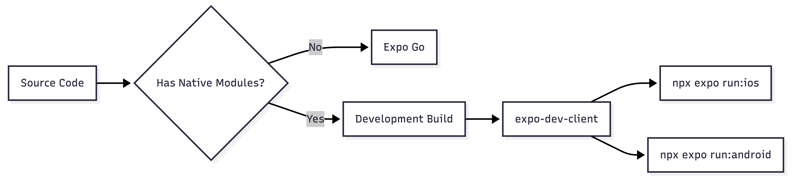

# Mobile App Setup

Step-by-step guide for setting up and running the VoiceMind Expo mobile app.

## Prerequisites

| Requirement    | Version    | Notes                                   |
| -------------- | ---------- | --------------------------------------- |
| Node.js        | >= 20.19.4 | `node -v` to check                      |
| pnpm           | Latest     | `npm install -g pnpm`                   |
| Xcode          | 26+        | iOS builds — install from Mac App Store |
| Android Studio | Latest     | Android builds — SDK 36 required        |
| CocoaPods      | Latest     | `sudo gem install cocoapods`            |

## Installation

From the monorepo root:

```bash
pnpm install
```

This installs dependencies for all workspace packages including the mobile app.

## Environment Variables

```bash
cp apps/mobile/.env.example apps/mobile/.env
```

Edit `apps/mobile/.env`:

```env
EXPO_PUBLIC_SUPABASE_URL=https://your-supabase-domain.com
EXPO_PUBLIC_SUPABASE_ANON_KEY=your-anon-key
EXPO_PUBLIC_LIVEKIT_URL=wss://livekit.yourdomain.com
```

For local development with Supabase CLI, use `http://localhost:54321` as the URL.

## Running the App

### Why Development Builds?

VoiceMind uses LiveKit for real-time audio, which requires native WebRTC modules. **Expo Go does not support native modules**, so you must use development builds.



### iOS

```bash
cd apps/mobile

# Generate native iOS project
npx expo prebuild --clean

# Build and run on simulator
npx expo run:ios

# Build and run on physical device
npx expo run:ios --device
```

### Android

```bash
cd apps/mobile

# Generate native Android project
npx expo prebuild --clean

# Build and run on emulator
npx expo run:android

# Build and run on physical device
npx expo run:android --device
```

### Start Dev Server Only

If you've already built the native app:

```bash
pnpm dev:mobile
# or
cd apps/mobile && npx expo start --dev-client
```

## Project Structure

```
apps/mobile/
├── app/                    # Expo Router — file-based routing
│   ├── _layout.tsx         # Root layout (AuthProvider + guard)
│   ├── (auth)/             # Auth screens (not logged in)
│   │   ├── _layout.tsx
│   │   ├── login.tsx
│   │   └── register.tsx
│   ├── (tabs)/             # Main app tabs (logged in)
│   │   ├── _layout.tsx
│   │   ├── index.tsx       # Recordings list
│   │   ├── record.tsx      # Recording screen
│   │   └── settings.tsx    # Settings
│   └── recording/
│       └── [id].tsx        # Recording detail + playback
├── components/ui/          # Gluestack UI components
├── hooks/                  # Custom React hooks
│   ├── use-auth.ts
│   ├── use-recordings.ts
│   └── use-audio-player.ts
├── lib/                    # Core libraries
│   ├── supabase.ts         # Supabase client
│   ├── auth-context.tsx    # Auth context + provider
│   └── livekit.ts          # LiveKit initialization
├── assets/                 # Images, fonts
├── app.json                # Expo configuration
├── metro.config.js         # Metro bundler (monorepo + NativeWind)
├── tailwind.config.ts      # Tailwind CSS theme
├── babel.config.js         # Babel (NativeWind preset)
└── global.css              # Tailwind directives
```

## Navigation Flow


## Styling

VoiceMind uses **NativeWind v4** (Tailwind CSS for React Native):

```tsx
// Tailwind classes work directly on RN components
<View className="flex-1 bg-background p-4">
  <Text className="text-foreground text-lg font-bold">Hello</Text>
</View>
```

Custom theme colors are defined in `tailwind.config.ts`:

| Token              | Value     | Usage                       |
| ------------------ | --------- | --------------------------- |
| `primary`          | `#6366F1` | Buttons, active tabs, links |
| `foreground`       | `#0F172A` | Primary text                |
| `muted-foreground` | `#64748B` | Secondary text              |
| `background`       | `#F8FAFC` | Screen backgrounds          |
| `card`             | `#FFFFFF` | Card surfaces               |
| `border`           | `#E2E8F0` | Borders, dividers           |
| `destructive`      | `#EF4444` | Delete, sign out            |

## Monorepo Resolution

The `metro.config.js` is configured to resolve packages from the monorepo root:

```js
config.watchFolders = [monorepoRoot];
config.resolver.nodeModulesPaths = [
  path.resolve(projectRoot, 'node_modules'),
  path.resolve(monorepoRoot, 'node_modules'),
];
```

This allows importing from `@voicemind/shared`:

```tsx
import { formatDuration, type Recording } from '@voicemind/shared';
```

## Troubleshooting

| Issue                          | Solution                                                          |
| ------------------------------ | ----------------------------------------------------------------- |
| `expo-dev-client` not found    | Run `npx expo install expo-dev-client`                            |
| Metro bundler stale cache      | `npx expo start --clear`                                          |
| iOS build fails with pods      | `cd ios && pod install --repo-update`                             |
| NativeWind styles not applying | Ensure `babel.config.js` has `nativewind/babel` preset            |
| LiveKit not connecting         | Verify `EXPO_PUBLIC_LIVEKIT_URL` starts with `wss://`             |
| Android build OOM              | Add `org.gradle.jvmargs=-Xmx4096m` to `android/gradle.properties` |

## Useful Commands

```bash
# Diagnose common issues
npx expo-doctor

# Clear all caches and rebuild
npx expo prebuild --clean && npx expo run:ios

# View dependency tree
pnpm ls --filter @voicemind/mobile

# Type check
pnpm typecheck
```
