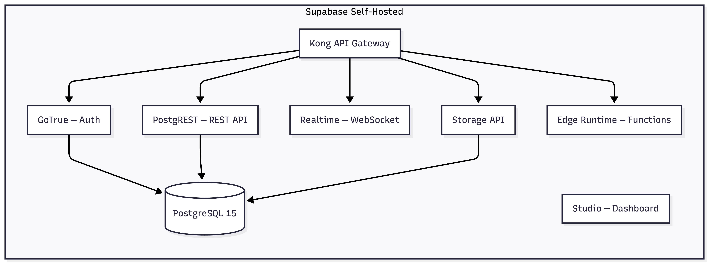

# Supabase Setup (Self-Hosted)

Guide for deploying self-hosted Supabase via Docker on your VPS.

## What You Get



## Step 1 — Clone Supabase Docker

```bash
ssh your-vps

cd /opt
git clone --depth 1 https://github.com/supabase/supabase
cd supabase/docker
cp .env.example .env
```

## Step 2 — Generate Secrets

From your VoiceMind repo:

```bash
cd infrastructure
./scripts/generate-secrets.sh
```

Or generate manually:

```bash
# Postgres password
openssl rand -base64 32

# JWT secret (min 32 chars)
openssl rand -hex 32
```

Generate Supabase API keys using the [Supabase JWT tool](https://supabase.com/docs/guides/self-hosting/docker#generate-api-keys) with your JWT secret.

## Step 3 — Configure Environment

Edit `/opt/supabase/docker/.env`:

```env
############
# Secrets
############
POSTGRES_PASSWORD=<generated-password>
JWT_SECRET=<generated-jwt-secret>
ANON_KEY=<generated-anon-key>
SERVICE_ROLE_KEY=<generated-service-role-key>

############
# URLs
############
SITE_URL=https://your-app-domain.com
API_EXTERNAL_URL=https://supabase.yourdomain.com

############
# Auth — Google OAuth
############
GOTRUE_EXTERNAL_GOOGLE_ENABLED=true
GOTRUE_EXTERNAL_GOOGLE_CLIENT_ID=<your-google-client-id>
GOTRUE_EXTERNAL_GOOGLE_SECRET=<your-google-client-secret>
GOTRUE_EXTERNAL_GOOGLE_REDIRECT_URI=https://supabase.yourdomain.com/auth/v1/callback
GOTRUE_EXTERNAL_GOOGLE_SKIP_NONCE_CHECK=true

############
# SMTP (required for email confirmations)
############
SMTP_HOST=smtp.your-provider.com
SMTP_PORT=465
SMTP_USER=your-email
SMTP_PASS=your-password
SMTP_ADMIN_EMAIL=admin@yourdomain.com
```

## Step 4 — Start Supabase

```bash
cd /opt/supabase/docker
docker compose pull
docker compose up -d
```

Verify services are running:

```bash
docker compose ps
```

All services should show `Up (healthy)`.

## Step 5 — Run Migrations

Copy migration files from your repo to the VPS and execute them against Postgres:

```bash
# From your local machine
scp packages/supabase/migrations/*.sql your-vps:/tmp/migrations/

# On the VPS
cd /opt/supabase/docker
for f in /tmp/migrations/*.sql; do
  docker compose exec db psql -U supabase_admin -d postgres -f "$f"
  echo "Applied: $f"
done
```

Migration order:

| File                           | Creates                                                  |
| ------------------------------ | -------------------------------------------------------- |
| `00001_create_profiles.sql`    | `profiles` table, auto-create trigger, RLS               |
| `00002_create_recordings.sql`  | `recordings` table with status check, RLS                |
| `00003_create_transcripts.sql` | `transcripts` table with JSONB words, RLS                |
| `00004_create_summaries.sql`   | `summaries` table with key_points, RLS                   |
| `00005_create_storage.sql`     | `recordings` storage bucket, upload/read/delete policies |

## Step 6 — Google OAuth Setup

1. Go to [Google Cloud Console](https://console.cloud.google.com/)
2. Create a new project or select existing
3. Navigate to **APIs & Services > Credentials**
4. Create **OAuth 2.0 Client ID** (Web application type)
5. Add authorized redirect URI: `https://supabase.yourdomain.com/auth/v1/callback`
6. For iOS: Create an iOS client ID with your bundle identifier (`com.voicemind.app`)
7. For Android: Create an Android client ID with your SHA-1 fingerprint
8. Copy Client ID and Secret into your `.env` file
9. Restart auth service:

```bash
docker compose restart auth
```

## Step 7 — Deploy Edge Functions

Edge functions live in `packages/supabase/functions/`. Deploy them using the Supabase CLI:

```bash
# Install Supabase CLI if not present
npm install -g supabase

# Link to your project
supabase link --project-ref <your-project-ref>

# Deploy all functions
supabase functions deploy livekit-token
supabase functions deploy transcribe
supabase functions deploy summarize

# Set secrets for edge functions
supabase secrets set \
  LIVEKIT_API_KEY=<key> \
  LIVEKIT_API_SECRET=<secret> \
  OPENAI_API_KEY=<key>
```

See [Edge Functions API](edge-functions.md) for full details.

## Verification

```bash
# Check API health
curl https://supabase.yourdomain.com/rest/v1/ \
  -H "apikey: <your-anon-key>"

# Check auth
curl https://supabase.yourdomain.com/auth/v1/settings

# Access Studio
open https://studio.yourdomain.com
```

## Maintenance

```bash
# View logs
docker compose logs -f auth       # Auth issues
docker compose logs -f rest       # API errors
docker compose logs -f db         # Postgres logs

# Restart a service
docker compose restart auth

# Update Supabase
cd /opt/supabase/docker
git pull
docker compose pull
docker compose up -d

# Backup Postgres
docker compose exec db pg_dump -U supabase_admin postgres > backup.sql
```

## Related Guides

- [Infrastructure Overview](infrastructure.md) — VPS requirements, Docker, Caddy
- [Database Schema](database-schema.md) — Full schema documentation
- [Edge Functions](edge-functions.md) — API reference
